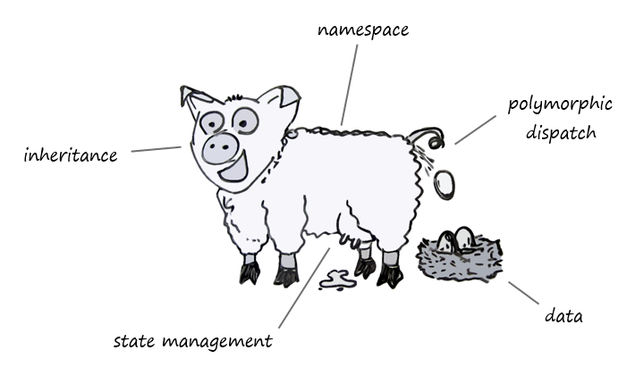
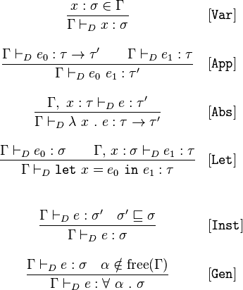

&nbsp;

# Static &amp; Dynamic  <!-- .element: style="color: #42affa" -->

## JVM type systems

#### Java / Scala / Groovy / Clojure  <!-- .element: style="color: #d0f0ff" -->

&nbsp;

&nbsp;

(Osvaldas Grigas | [@ogrigas](http://twitter.com/ogrigas))

  <!-- .element: class="plain" width="150" -->

---

## This talk is

- Totally subjective
- Based on my own experience

---

## Is it worth going there again?

- Yes. These questions are still actively discussed
- Yes. Languages evolve
- Yes. It's an experience report

---

### class

---

## My production experience (non-JVM)

- JavaScript
- PHP
- C#
- Python

---

## My production experience (JVM)

- Java
- Clojure
- Scala
- Groovy

---

## Strong typing

- All have type systems
- All are strongly typed
- My experience with weekly typed languages was mostly miserable

---

## Documentation

- Encoding domain knowledge
- Groovy type hints
- Clojure type hints
- Clojure "Schema" library

---

## Type inference

 <!-- .element style="background: white; padding: 0.5em" -->

Hindley-Milner

---

## Type inference

- Loses the value of documentation
- Scala discourages inferred types on signatures
